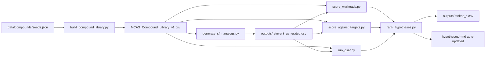

# OpenMCAS

**An open, hypothesis-generation engine for MCAS / MCAD rescue, maintenance, and remission compounds.**

[](LICENSE)
[](https://github.com/mrdulasolutions/MCAS.Opensource/actions/workflows/validate.yml)
[](experiments/)
[](data/compounds/MCAS_Compound_Library_v1.csv)
[](outputs/reinvent_generated.csv)

> ⚠️ **Not medical advice.** Computational hypotheses + in silico predictions
> only. Not a substitute for clinical care. Do not self-treat.
> See [docs/disclaimers.md](docs/disclaimers.md).

---

## 🧭 Start here — pick your door

| You are… | Go here |
|---|---|
| 🧍 **A patient or caregiver** | [audiences/for-patients.md](audiences/for-patients.md) |
| 🩺 **A clinician** | [audiences/for-clinicians.md](audiences/for-clinicians.md) |
| 🔬 **A researcher** | [audiences/for-researchers.md](audiences/for-researchers.md) |
| 🎓 **An academic lab** | [audiences/for-academia.md](audiences/for-academia.md) |
| 🤝 **A nonprofit / foundation** | [audiences/for-nonprofits.md](audiences/for-nonprofits.md) |
| 🏭 **Industry / pharma** | [audiences/for-industry.md](audiences/for-industry.md) |
| 💻 **A developer** | [audiences/for-developers.md](audiences/for-developers.md) |
| 📰 **Press / media** | [audiences/for-press.md](audiences/for-press.md) |

Or read the [FAQ](docs/faq.md) and [glossary](docs/glossary.md).

---

## What this is

A reproducible MIT-licensed pipeline that takes pharma drugs, herbs,
supplements, and AI-generated novel analogs and ranks them by their
plausibility as MCAS / MCAD candidates across three categories:

- **Rescue** — acute mediator blockade.
- **Maintenance** — daily stabilization.
- **Remission** — upstream / root-cause reversal.

Every prediction is published openly so any researcher can audit,
falsify, or extend it. No paywalls, no IP capture, no pharma gatekeeping.

---

## Live results

These tables are auto-refreshed every time the ranking script runs.

### 🔴 Rescue top 5
| # | Compound | Class | Composite |
|---|---|---|---|
| 1 | Fexofenadine | H1 antagonist (2nd-gen) | 0.540 |
| 2 | Cetirizine | H1 antagonist (2nd-gen) | 0.539 |
| 3 | Diphenhydramine | H1 antagonist (1st-gen) | 0.534 |
| 4 | Hydroxyzine | H1 antagonist (1st-gen) | 0.532 |
| 5 | Loratadine | H1 antagonist (2nd-gen) | 0.523 |

[Full ranking →](hypotheses/rescue.md#top-ai-ranked-candidates)

### 🟡 Maintenance top 5
| # | Compound | Class | Composite |
|---|---|---|---|
| 1 | Curcumin | Polyphenol / Michael acceptor / Nrf2 | 0.628 |
| 2 | Rosmarinic acid | Polyphenol | 0.560 |
| 3 | Thymoquinone | Quinone (Nigella) | 0.559 |
| 4 | Resveratrol | Stilbene / Nrf2 / MRGPRX2 | 0.487 |
| 5 | Luteolin | Flavonoid (BBB-crossing) | 0.479 |

[Full ranking →](hypotheses/maintenance.md#top-ai-ranked-candidates)

### 🟢 Remission top 5
| # | Compound | Class | Composite |
|---|---|---|---|
| 1 | **Sulforaphane** | Natural ITC / KEAP1 covalent / Nrf2 | **0.628** |
| 2 | Phenethyl-ITC | Natural ITC (watercress) / KEAP1 / HDAC | 0.589 |
| 3 | Erucin | Natural sulfide ITC (arugula) | 0.490 |
| 4 | Benzyl-ITC | Natural ITC (papaya / cress) | 0.483 |
| 5 | Masitinib | KIT TKI | 0.472 |

[Full ranking →](hypotheses/remission.md#top-ai-ranked-candidates)

---

## How it works



Each script is documented as a [standardized experiment report](experiments/):

| ID | Experiment | Method |
|----|---|---|
| [EXP-001](experiments/EXP-001-sfn-seeded-analog-generation.md) | SFN-class analog generation | RDKit BRICS + bioisostere + warhead-graft, 7 ITC seeds |
| [EXP-002](experiments/EXP-002-ligand-based-target-screening.md) | Ligand-based virtual screening | Tanimoto vs curated references, 8 MCAS targets |
| [EXP-003](experiments/EXP-003-covalent-warhead-scoring.md) | Covalent-warhead SMARTS + KEAP1 pharmacophore | 13 reactive-group patterns |
| [EXP-004](experiments/EXP-004-admet-qsar.md) | ADMET QSAR | RandomForest on PyTDC tasks (hERG / AMES / BBB) — AUC 0.89–0.91 |
| [EXP-005](experiments/EXP-005-multi-objective-ranking.md) | Multi-objective ranking | Composite of evidence + target + warhead + safety + drug-likeness |

---

## Reproduce the whole thing in 3 minutes

```bash
git clone https://github.com/mrdulasolutions/MCAS.Opensource.git
cd MCAS.Opensource
python -m venv .venv && source .venv/bin/activate
pip install -e . PyTDC scikit-learn 'setuptools<81'

python scripts/build_compound_library.py
python scripts/validate_smiles.py
python scripts/generate_sfn_analogs.py
python scripts/score_warheads.py
python scripts/score_against_targets.py
python scripts/run_qsar.py
python scripts/rank_hypotheses.py
```

The `hypotheses/*.md` files will be re-populated with the latest top-10
tables. Diff against the existing ones to see what changed.

---

## Repo map

```
audiences/              Audience-segmented onramps (patients / clinicians / researchers / academia / nonprofits / industry / developers / press)
data/                   Curated compound library, injury mechanisms, triggers, targets
scripts/                The 7-script pipeline (build → generate → score → rank)
notebooks/              Same pipeline in Jupyter form (01–05)
experiments/            Standardized experiment reports (EXP-001 … EXP-005)
hypotheses/             Rescue / maintenance / remission / injury / trigger hypothesis docs
outputs/                Pipeline outputs (rankings, predictions, generated analogs)
docs/                   Methods, disclaimers, wet-lab protocols, contributing, FAQ, glossary
.claude/skills/         Claude Code skill plugin for guided contribution
.github/                Issue templates (8 routes) + PR template + CI
```

---

## Contribute

[Add a compound](.github/ISSUE_TEMPLATE/compound_suggestion.md) ·
[Report a trigger](.github/ISSUE_TEMPLATE/trigger_report.md) ·
[Propose a hypothesis](.github/ISSUE_TEMPLATE/hypothesis_proposal.md) ·
[Academic collaboration](.github/ISSUE_TEMPLATE/academic_collaboration.md) ·
[Nonprofit partnership](.github/ISSUE_TEMPLATE/nonprofit_partnership.md) ·
[Wet-lab pre-registration](.github/ISSUE_TEMPLATE/wet_lab_preregistration.md)

Or in [Claude Code](https://claude.ai/code), use one of the bundled skills:
`/openmcas-add-compound`, `/openmcas-report-trigger`,
`/openmcas-run-experiment`, `/openmcas-new-experiment-report`. See [.claude/README.md](.claude/README.md).

### Code of Conduct + governance

[CODE_OF_CONDUCT.md](CODE_OF_CONDUCT.md) ·
[SECURITY.md](SECURITY.md) ·
[ROADMAP.md](ROADMAP.md)

---

## Why this exists

MCAS / MCAD patients deserve better than symptom-by-symptom management.
We're publishing every hypothesis and prediction openly so that no finding
can be locked behind a patent. If a wet-lab validates a compound here,
the world gets it. If a wet-lab refutes one, the world gets that too.

## Cite

See [CITATION.cff](CITATION.cff). Cite the repo + the commit hash you used.
Quarterly Zenodo DOI snapshots are on the [roadmap](ROADMAP.md).

## License

MIT. Fork it, remix it, publish on bioRxiv, run wet-lab assays, build
better. Attribution appreciated, not required.
