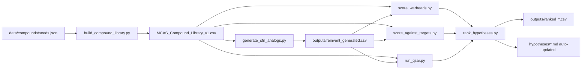

# OpenMCAS

**Open, reproducible hypothesis generation for MCAS / MCAD compounds — ranked transparently for rescue, maintenance, and remission.**

[](LICENSE)
[](https://github.com/mrdulasolutions/MCAS.Opensource/actions/workflows/validate.yml)
[](https://github.com/mrdulasolutions/MCAS.Opensource/actions/workflows/sync-hf-space.yml)
[](experiments/)
[](experiments/EXP-016-mast-cell-predictor.md)
[](experiments/EXP-011-chembl-bioassay-predictor.md)
[](data/compounds/MCAS_Compound_Library_v1.csv)
[](outputs/reinvent_generated.csv)
[](experiments/EXP-006-known-actives-recovery.md)
[](experiments/EXP-007-negative-control-benchmark.md)
[](experiments/EXP-008-sensitivity-analysis.md)
[](experiments/EXP-009-keap1-vina-docking.md)
[](https://huggingface.co/spaces/MRDula/openmcas-browser)
[](AGENT_CARD.md)

> ⚠️ **Not medical advice.** Computational hypotheses + in silico predictions
> only. Not a substitute for clinical care. Do not self-treat.
> See [docs/disclaimers.md](docs/disclaimers.md).

## What this is, in one paragraph

A laptop-runnable, MIT-licensed pipeline that takes pharma drugs, herbs,
supplements, and AI-generated novel analogs, scores them against MCAS-relevant
targets (KEAP1 / MRGPRX2 / KIT / FcεRI / HRH1–4 / CYSLTR1 / BTK / GLP1R),
filters by covalent-warhead chemistry + predicted ADMET safety, and produces
a transparent **composite ranking** across rescue / maintenance / remission
categories.

The ranking has been audited in four independent ways:

1. **It finds what it should.** 21 held-out clinical mast-cell drugs blind-scored → **100% recovery@20** ([EXP-006](experiments/EXP-006-known-actives-recovery.md)).
2. **It rejects what it shouldn't.** 20 unrelated drugs (statins / antihypertensives / anticonvulsants / etc.) blind-scored → **100% precision@10** — all correctly ranked outside every top-10 ([EXP-007](experiments/EXP-007-negative-control-benchmark.md)).
3. **It doesn't depend on weight-cherry-picking.** ±50% sweep of all six composite weights → **min Spearman ρ = 0.93** vs. baseline ([EXP-008](experiments/EXP-008-sensitivity-analysis.md)).
4. **Real physics agrees with the chemistry.** AutoDock Vina docking against KEAP1 Kelch domain (PDB 4L7B) for the top-50 remission candidates → **every top-15 by ligand efficiency carries the isothiocyanate warhead** ([EXP-009](experiments/EXP-009-keap1-vina-docking.md)).

## Try it in your browser (no clone, no install)

🌐 **Live viewer:** **[huggingface.co/spaces/MRDula/openmcas-browser](https://huggingface.co/spaces/MRDula/openmcas-browser)** — public, MIT-licensed, browse all ranked candidates, filter by mechanism / evidence / warhead, inspect ADMET predictions per compound. (Self-host: [docs/deploying-the-viewer.md](docs/deploying-the-viewer.md).)

---

## 🧭 Start here — pick your door

| You are… | Go here |
|---|---|
| 🧍 **A patient or caregiver** | [audiences/for-patients.md](audiences/for-patients.md) |
| 🩺 **A clinician** | [audiences/for-clinicians.md](audiences/for-clinicians.md) |
| 🔬 **A researcher** | [audiences/for-researchers.md](audiences/for-researchers.md) |
| 🎓 **An academic lab** | [audiences/for-academia.md](audiences/for-academia.md) |
| 🤝 **A nonprofit / foundation** | [audiences/for-nonprofits.md](audiences/for-nonprofits.md) |
| 🏭 **Industry / pharma** | [audiences/for-industry.md](audiences/for-industry.md) |
| 💻 **A developer** | [audiences/for-developers.md](audiences/for-developers.md) |
| 📰 **Press / media** | [audiences/for-press.md](audiences/for-press.md) |

Or read the [FAQ](docs/faq.md) and [glossary](docs/glossary.md).

---

## What this is

A reproducible MIT-licensed pipeline that takes pharma drugs, herbs,
supplements, and AI-generated novel analogs and ranks them by their
plausibility as MCAS / MCAD candidates across three categories:

- **Rescue** — acute mediator blockade.
- **Maintenance** — daily stabilization.
- **Remission** — upstream / root-cause reversal.

Every prediction is published openly so any researcher can audit,
falsify, or extend it. No paywalls, no IP capture, no pharma gatekeeping.

---

## Live results

> 🤖 **Auto-generated artifacts.** The tables below — and the Top-10 tables in `hypotheses/{rescue,maintenance,remission}.md` — are produced by `scripts/rank_hypotheses.py` from the current library + generated analogs + target scores + warhead scores + ADMET QSAR. Each Top-10 carries a provenance line with timestamp + commit hash. **Re-running the script overwrites them.** Composite formula: [EXP-005](experiments/EXP-005-multi-objective-ranking.md). Audit: [EXP-006](experiments/EXP-006-known-actives-recovery.md).

### 🔴 Rescue top 5
| # | Compound | Class | Composite |
|---|---|---|---|
| 1 | Fexofenadine | H1 antagonist (2nd-gen) | 0.540 |
| 2 | Cetirizine | H1 antagonist (2nd-gen) | 0.539 |
| 3 | Diphenhydramine | H1 antagonist (1st-gen) | 0.534 |
| 4 | Hydroxyzine | H1 antagonist (1st-gen) | 0.532 |
| 5 | Loratadine | H1 antagonist (2nd-gen) | 0.523 |

[Full ranking →](hypotheses/rescue.md#top-ai-ranked-candidates)

### 🟡 Maintenance top 5
| # | Compound | Class | Composite |
|---|---|---|---|
| 1 | Curcumin | Polyphenol / Michael acceptor / Nrf2 | 0.628 |
| 2 | Rosmarinic acid | Polyphenol | 0.560 |
| 3 | Thymoquinone | Quinone (Nigella) | 0.559 |
| 4 | Resveratrol | Stilbene / Nrf2 / MRGPRX2 | 0.487 |
| 5 | Luteolin | Flavonoid (BBB-crossing) | 0.479 |

[Full ranking →](hypotheses/maintenance.md#top-ai-ranked-candidates)

### 🟢 Remission top 5 (post-EXP-009)
| # | Compound | Class | Composite | Vina kcal/mol |
|---|---|---|---|---|
| 1 | **Erucin** | Sulfide ITC (arugula) — longer plasma t½ vs SFN | **0.673** | -3.70 |
| 2 | **Sulforaphane** | Natural ITC / KEAP1 covalent / Nrf2 | 0.669 | -4.04 |
| 3 | Phenethyl-ITC | Natural ITC (watercress) / KEAP1 / HDAC | 0.636 | -5.20 |
| 4 | Iberin | Sulfoxide ITC (cabbage / broccoli) | 0.557 | -3.81 |
| 5 | Benzyl-ITC | Natural ITC (papaya / cress) | 0.533 | -5.13 |

> 🔄 Ranking reshuffled in EXP-009 after fixing three wrong PubChem CIDs in `seeds.json` (Iberin, Erucin, Sulforaphene were silently pointing at unrelated compounds). Erucin narrowly takes #1 on the corrected data — see [EXP-009 §0](experiments/EXP-009-keap1-vina-docking.md) for the disclosure.

[Full ranking →](hypotheses/remission.md#top-ai-ranked-candidates)

---

## How it works



Each script is documented as a [standardized experiment report](experiments/):

| ID | Experiment | Method |
|----|---|---|
| [EXP-001](experiments/EXP-001-sfn-seeded-analog-generation.md) | SFN-class analog generation | RDKit BRICS + bioisostere + warhead-graft, 7 ITC seeds |
| [EXP-002](experiments/EXP-002-ligand-based-target-screening.md) | Ligand-based virtual screening | Tanimoto vs curated references, 8 MCAS targets |
| [EXP-003](experiments/EXP-003-covalent-warhead-scoring.md) | Covalent-warhead SMARTS + KEAP1 pharmacophore | 13 reactive-group patterns |
| [EXP-004](experiments/EXP-004-admet-qsar.md) | ADMET QSAR | RandomForest on PyTDC tasks (hERG / AMES / BBB) — AUC 0.89–0.91 |
| [EXP-005](experiments/EXP-005-multi-objective-ranking.md) | Multi-objective ranking | Composite of evidence + target + warhead + safety + drug-likeness |
| [EXP-006](experiments/EXP-006-known-actives-recovery.md) | Known Actives Recovery benchmark | Blind scoring of 21 held-out clinical drugs — **100% recovery@20** |
| [EXP-007](experiments/EXP-007-negative-control-benchmark.md) | Negative-control benchmark | 20 unrelated drugs — **100% precision@10**, all correctly rejected |
| [EXP-008](experiments/EXP-008-sensitivity-analysis.md) | Sensitivity analysis | ±50% per-weight sweep — **min Spearman ρ = 0.93**, SFN #1 stable in 100% of perturbations |
| [EXP-009](experiments/EXP-009-keap1-vina-docking.md) | KEAP1 Vina docking + data-bug fix | Real AutoDock Vina docking on 4L7B; **every top-15 by ligand efficiency carries the ITC warhead**. Disclosed + fixed three wrong PubChem CIDs |
| [EXP-010](experiments/EXP-010-joint-perturbation-lhs.md) | Joint-perturbation Latin-hypercube weight sweep | 200-sample LHS — **Erucin holds remission #1 in 91.5% of samples**; ITC top-5 in remission top-10 in ≥99% of samples |
| [EXP-011](experiments/EXP-011-chembl-bioassay-predictor.md) | ChEMBL bioassay pull + per-target activity predictors | **67,372 records across 11 MCAS targets**, CV R² 0.52–0.80 (median 0.69); integrated as +0.10 ChEMBL-validated potency bonus |
| [EXP-015](experiments/EXP-015-audit-retread.md) | Audit retread on post-ChEMBL composite | 3 of 4 audits held or tightened (precision@10 = 100%, min ρ tightened 0.933→0.946); remission recovery regression diagnosed as benchmark-label issue, not composite failure |
| [EXP-016](experiments/EXP-016-mast-cell-predictor.md) | Mast-cell-specific bioassay predictor (β-hex / LAD2 / HMC-1 / histamine release) | **CV AUC 0.916 ± 0.019** — strongest single model in the repo. Luteolin 0.728, Midostaurin 0.840. +0.05 universal bonus across all categories |
| [EXP-012](experiments/EXP-012-covalent-c151-adduct.md) | Covalent KEAP1-C151 dithiocarbamate adduct proxy | MMFF94 reaction-energy proxy for the actual SFN mechanism; every ITC produces favorable adduct (ΔE −32 to −76 kcal/mol) |
| [EXP-013](experiments/EXP-013-rl-generation.md) | Iterative REINVENT-style generation | 4-iter generate-and-select; **265 candidates**; drug-like aromatic sulfonyl-ITCs emerge in iter 3 (QED 0.59-0.60) |
| [EXP-017](experiments/EXP-017-enamine-availability-check.md) | Procurement check for top generated SFN-class analogs | **20 / 25 (80%)** novel analogs pass the Enamine REAL Space envelope; vendor lookup URLs published. Wet-lab bridge ready. |
| [EXP-019](experiments/EXP-019-cannabinoids-and-terpenes.md) | Cannabinoid + terpene library expansion + CB2 (CNR2) target | 24 new compounds (CBD / CBG / Δ9-THC / PEA / β-caryophyllene / α-bisabolol / linalool / limonene / eucalyptol / ...); **PEA #9 in maintenance**; all audits hold |
| [EXP-020](experiments/EXP-020-flavonoids-polyphenols-cannabinoid-acids.md) | Flavonoid + Nrf2 polyphenol + cannabinoid-acid expansion | 29 new compounds (16 mast-cell flavonoids + 8 Nrf2 polyphenols/triterpenes + 5 cannabinoid acids). **CBDA #24 maintenance**, Xanthohumol #28 (Michael warhead), Fisetin #38. Audits hold; surfaced piceatannol-SYK + carnosic-acid-quinone target/warhead gaps |

---

## Just browse the results (no install)

🌐 **Live Hugging Face Space:** **[huggingface.co/spaces/MRDula/openmcas-browser](https://huggingface.co/spaces/MRDula/openmcas-browser)** — read-only, public, refreshes when the pipeline reruns. Self-host recipe: [docs/deploying-the-viewer.md](docs/deploying-the-viewer.md).

Or locally:
```bash
pip install -r requirements-app.txt
streamlit run app.py
```

## Reproduce the whole thing in 3 minutes

```bash
git clone https://github.com/mrdulasolutions/MCAS.Opensource.git
cd MCAS.Opensource
python -m venv .venv && source .venv/bin/activate
pip install -e . PyTDC scikit-learn 'setuptools<81'

python scripts/build_compound_library.py
python scripts/validate_smiles.py
python scripts/generate_sfn_analogs.py
python scripts/score_warheads.py
python scripts/score_against_targets.py
python scripts/run_qsar.py
python scripts/rank_hypotheses.py
python scripts/benchmark_known_actives.py    # optional — held-out recovery audit
```

The `hypotheses/*.md` files will be re-populated with the latest top-10
tables. Diff against the existing ones to see what changed.

---

## Repo map

```
audiences/              Audience-segmented onramps (patients / clinicians / researchers / academia / nonprofits / industry / developers / press)
data/                   Curated compound library, injury mechanisms, triggers, targets
scripts/                The 7-script pipeline (build → generate → score → rank)
notebooks/              Same pipeline in Jupyter form (01–05)
experiments/            Standardized experiment reports (EXP-001 … EXP-005)
hypotheses/             Rescue / maintenance / remission / injury / trigger hypothesis docs
outputs/                Pipeline outputs (rankings, predictions, generated analogs)
docs/                   Methods, disclaimers, wet-lab protocols, contributing, FAQ, glossary
.claude/skills/         Claude Code skill plugin for guided contribution
.github/                Issue templates (8 routes) + PR template + CI
```

---

## Contribute

[Add a compound](.github/ISSUE_TEMPLATE/compound_suggestion.md) ·
[Report a trigger](.github/ISSUE_TEMPLATE/trigger_report.md) ·
[Propose a hypothesis](.github/ISSUE_TEMPLATE/hypothesis_proposal.md) ·
[Academic collaboration](.github/ISSUE_TEMPLATE/academic_collaboration.md) ·
[Nonprofit partnership](.github/ISSUE_TEMPLATE/nonprofit_partnership.md) ·
[Wet-lab pre-registration](.github/ISSUE_TEMPLATE/wet_lab_preregistration.md)

Or in [Claude Code](https://claude.ai/code), use one of the bundled skills:
`/openmcas-add-compound`, `/openmcas-report-trigger`,
`/openmcas-run-experiment`, `/openmcas-new-experiment-report`. See [.claude/README.md](.claude/README.md).

### Code of Conduct + governance

[CODE_OF_CONDUCT.md](CODE_OF_CONDUCT.md) ·
[SECURITY.md](SECURITY.md) ·
[ROADMAP.md](ROADMAP.md) ·
[CONTACT.md](CONTACT.md) ·
[AGENT_CARD.md](AGENT_CARD.md)

### 📖 Wiki

Pharmacology primers, per-compound deep dives, and patient-friendly
explainers live in the [**OpenMCAS wiki**](https://github.com/mrdulasolutions/MCAS.Opensource/wiki):

- [Route of Administration](https://github.com/mrdulasolutions/MCAS.Opensource/wiki/Route-of-Administration) — why the same compound behaves very differently buccal vs. swallowed
- [Buccal Rescue Pharmacology](https://github.com/mrdulasolutions/MCAS.Opensource/wiki/Buccal-Rescue-Pharmacology) — what makes a compound fast through the oral mucosa
- [1st vs 2nd Gen Antihistamines](https://github.com/mrdulasolutions/MCAS.Opensource/wiki/First-vs-Second-Gen-Antihistamines) — the BBB / drowsiness / rescue-onset tradeoff
- [Diphenhydramine Deep Dive](https://github.com/mrdulasolutions/MCAS.Opensource/wiki/Diphenhydramine-Deep-Dive)

### 📣 Patient-reported response observations

Anonymous reports of what compound + route + dose pattern has worked
or hasn't worked are tracked via the [response observation issue template](.github/ISSUE_TEMPLATE/response_observation.md).
No PHI; pattern-level data only. See an [example issue](https://github.com/mrdulasolutions/MCAS.Opensource/issues/1).

### Agent2Agent (A2A) protocol

This project publishes an [A2A agent card](AGENT_CARD.md) describing its
10 skills (library search, compound add, trigger report, ligand-based
screening, warhead scoring, ADMET QSAR, SFN-class analog generation,
multi-objective ranking, experiment-report scaffolding, hypothesis
proposal). The canonical machine-readable manifest is at
[`.well-known/agent-card.json`](.well-known/agent-card.json) (also at
[`/.well-known/agent.json`](/.well-known/agent.json) for legacy clients
and [`/a2a.json`](a2a.json) at root).

---

## Limitations (read before citing)

- **Author-chosen weights.** The composite formula in [EXP-005](experiments/EXP-005-multi-objective-ranking.md) was set by hand, not learned. Sensitivity analysis is on the [roadmap](ROADMAP.md).
- **Ligand-based screening, not docking.** The `score_*` files contain Tanimoto similarities to curated reference ligands per target — a defensible early-triage signal, but not a substitute for physics-based pose prediction. Real Vina / DiffDock against KEAP1 Kelch (PDB 4L7B) is queued.
- **QSAR is RandomForest on Morgan FPs.** Strong baseline (validation AUC 0.89–0.91 on PyTDC) but graph neural nets like ChemProp typically add 1–3 AUC points. PR welcome.
- **No metabolism / interaction modeling.** CYP / GST / UGT effects (the actual major liability for sulforaphane) are an open feature gap.
- **Reference-set self-similarity.** Known anchors get Tanimoto = 1.0 against themselves; the ranking script accounts for this but it still caps recovery@5/@10 in some categories ([EXP-006 §7](experiments/EXP-006-known-actives-recovery.md)).
- **21-compound recovery benchmark is small.** Expansion to 50+ via ChEMBL bioassay pull is in the [roadmap](ROADMAP.md).
- **No human validation.** Every headline result is a *hypothesis*. Wet-lab validation campaigns are how this becomes evidence — see [audiences/for-academia.md](audiences/for-academia.md).
- **Negative-control set missing.** We have a positive-control benchmark; we have not yet shown that compounds with no plausible MCAS mechanism rank low. That's the next benchmark.

## Why this exists

MCAS / MCAD patients deserve better than symptom-by-symptom management.
We're publishing every hypothesis and prediction openly so that no finding
can be locked behind a patent. If a wet-lab validates a compound here,
the world gets it. If a wet-lab refutes one, the world gets that too.

## Who's behind it

**MR Dula Medical** (a DBA of **MR Dula Enterprise, LLC**), Raleigh, NC, USA.
Independent open-research project. Not affiliated with pharma, not VC-backed,
not currently a 501(c)(3). See [CONTACT.md](CONTACT.md) for all contact routes.

## Cite

See [CITATION.cff](CITATION.cff). Cite the repo + the commit hash you used.
Quarterly Zenodo DOI snapshots are on the [roadmap](ROADMAP.md).

## License

MIT. Fork it, remix it, publish on bioRxiv, run wet-lab assays, build
better. Attribution appreciated, not required.
